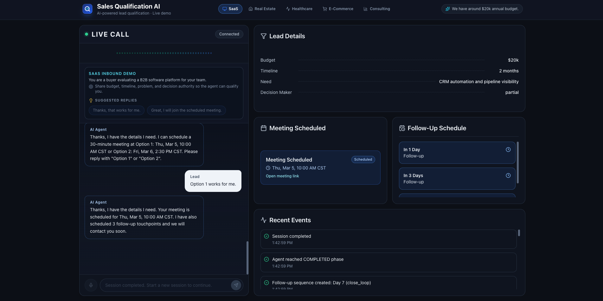
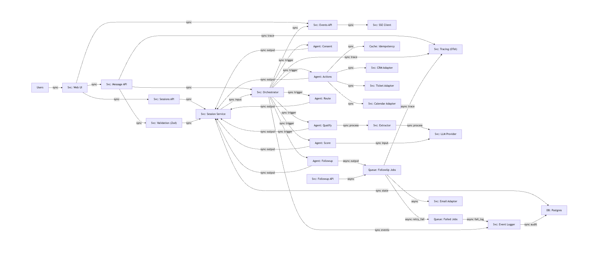
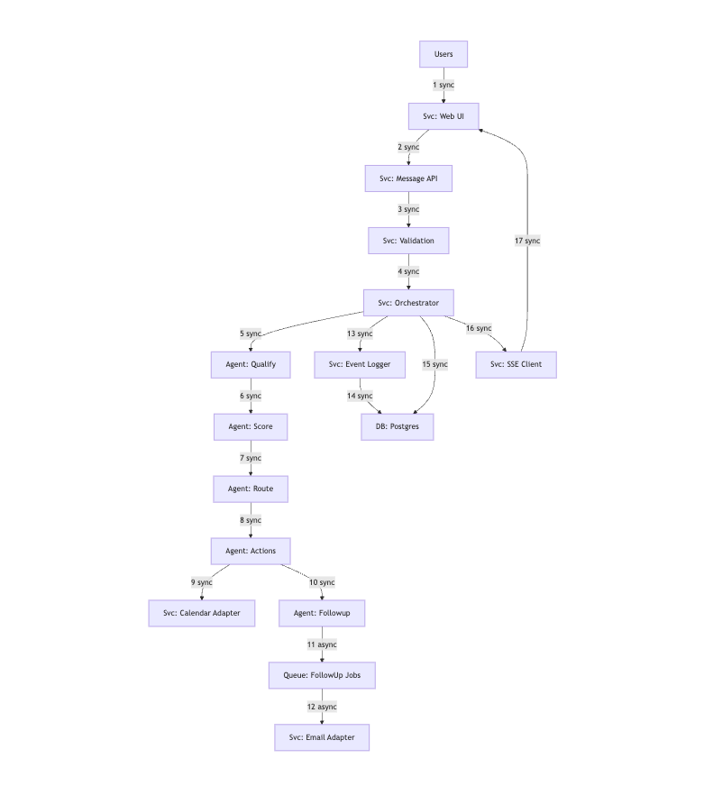

# Sales Qualification AI

  

An AI agent that qualifies sales leads through structured conversation. It asks questions, extracts lead data in real time, scores the lead, and takes action: booking meetings, creating CRM records, and scheduling follow-ups. Everything updates a live dashboard as it happens.

Built as a portfolio project to demonstrate production AI engineering patterns.

## How it works

User picks an industry, starts a conversation, and the agent handles the rest:

**Consent** > **5 qualification questions** > **Lead scoring** > **Routing** > **Actions (CRM, Calendar, Tickets)** > **Follow-up scheduling**

Each step is a node in a custom state machine. The agent extracts structured fields (budget, timeline, need, decision maker) from every answer using Zod-validated LLM calls. The dashboard updates live over Server-Sent Events.

## Architecture

## Tech stack

**Frontend:** Next.js 14 (App Router), React 18, TypeScript, Tailwind CSS, shadcn/ui, Zustand, Framer Motion

**Backend:** Next.js API Routes, Zod validation, Server-Sent Events, OpenTelemetry

**AI:** Vercel AI SDK with support for Cloudflare Workers AI, OpenAI, and Mock provider

**Database:** PostgreSQL with Prisma ORM

**Orchestration:** Custom StateGraph engine (~200 lines, no LangGraph dependency)

**Testing:** Vitest, Playwright, axe-core for accessibility

## Production patterns used

**Adapter pattern.** CRM, Calendar, Ticket, and Email integrations share a typed interface. The demo ships with mock implementations. Swapping to HubSpot or Google Calendar means implementing the same interface.

**Idempotency.** Every adapter call carries a unique key. Retries return the cached result instead of creating duplicates.

**Event sourcing.** Every state transition, extraction, and tool call is an immutable event. The dashboard and analytics are projections of this log.

**Guardrails.** Consent gate, PII redaction, content filtering, and a configurable policy engine.

## Deploy (Free-Friendly)

Recommended stack:

- **Hosting:** Vercel Hobby
- **Database:** Neon or Supabase free Postgres
- **LLM:** Cloudflare Workers AI free tier
- **Background jobs:** GitHub Actions cron (`.github/workflows/follow-up-runner.yml`)

Before deploying, set these required environment variables:

- `DATABASE_URL`
- `LLM_PROVIDER=cloudflare`
- `CLOUDFLARE_ACCOUNT_ID`
- `CLOUDFLARE_API_TOKEN`
- `NEXT_PUBLIC_APP_URL`
- `ADMIN_API_TOKEN` (required for `/api/admin/run-followups`)

For GitHub Actions follow-up processing, add this repo secret:

- `DATABASE_URL`

## Docs

|                                                 |                                                       |
| ----------------------------------------------- | ----------------------------------------------------- |
| [General](docs/01-general.md)                   | Project overview, glossary, conventions               |
| [Architecture](docs/02-architecture.md)         | System design, component diagrams, data flow          |
| [Tech Stack](docs/03-tech-stack.md)             | Every dependency with version and rationale           |
| [Frontend](docs/04-frontend.md)                 | Components, design system, voice UI, state management |
| [Backend](docs/05-backend.md)                   | API specs, middleware, SSE, provider abstractions     |
| [AI Agents](docs/06-ai-agents.md)               | Orchestrator engine, node logic, prompts, guardrails  |
| [Database](docs/07-database-schema.md)          | Prisma schema, event sourcing, indexing               |
| [Workflow](docs/08-workflow.md)                 | State machine, industry packs, routing, follow-ups    |
| [Design Decisions](docs/14-design-decisions.md) | Tradeoffs and reasoning behind every choice           |
