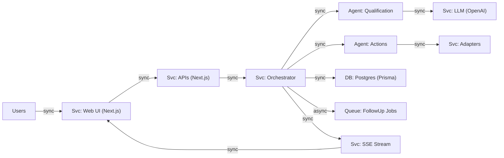
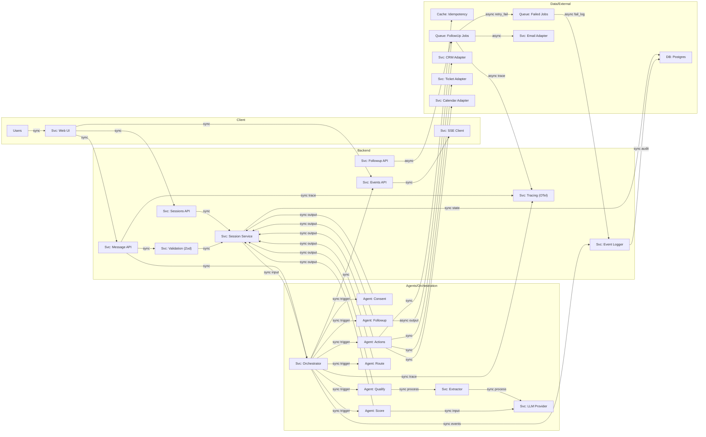
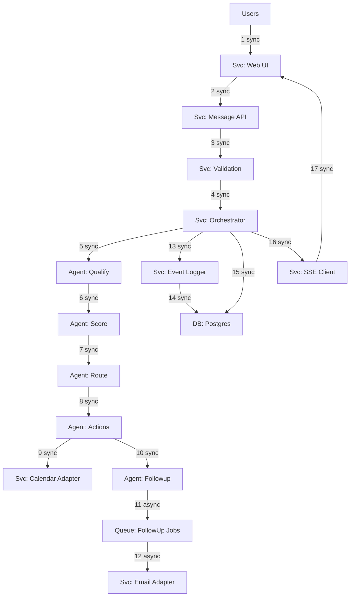

# 02 — System Architecture

> High-level system design, component diagrams, data flow, and architectural decisions.

---

## 2.1 Architecture Overview

The system follows a **layered architecture** with clear separation of concerns:

### Mermaid Diagrams (Design Review)

The Mermaid versions are saved in this repo for easy preview and copy:

- `docs/diagrams/staff-architecture-review.md`

#### Diagram A — Context



#### Diagram B — Main



#### Diagram C — Critical Path



```
┌─────────────────────────────────────────────────────────────┐
│                     PRESENTATION LAYER                       │
│  Next.js App Router │ React Components │ shadcn/ui + Tailwind│
│  Voice UI (Web Audio API) │ SSE Client │ Zustand Stores      │
└──────────────────────────┬──────────────────────────────────┘
                           │ HTTP / SSE
┌──────────────────────────┴──────────────────────────────────┐
│                       API LAYER                              │
│  Next.js Route Handlers │ Zod Validation │ Auth Middleware    │
│  SSE Emitter │ Rate Limiting                                 │
└──────────────────────────┬──────────────────────────────────┘
                           │
┌──────────────────────────┴──────────────────────────────────┐
│                   ORCHESTRATION LAYER                         │
│  Custom StateGraph Engine │ Node Executor                    │
│  State Manager │ Transition Engine │ Error Recovery           │
└────┬─────────────┬──────────────┬───────────────┬───────────┘
     │             │              │               │
┌────┴────┐  ┌─────┴─────┐  ┌────┴─────┐  ┌──────┴──────┐
│ AI LAYER│  │EXTRACTION │  │ ADAPTERS │  │  GUARDRAILS │
│ LLM     │  │ Zod Schema│  │ CRM      │  │  Consent    │
│ STT/TTS │  │ Validation│  │ Ticket   │  │  PII Redact │
│ Provider│  │ Follow-up │  │ Calendar │  │  Policy     │
│ Abstract│  │ Questions │  │ Email    │  │  Content    │
└────┬────┘  └─────┬─────┘  └────┬─────┘  └──────┬──────┘
     │             │              │               │
┌────┴─────────────┴──────────────┴───────────────┴───────────┐
│                    INFRASTRUCTURE LAYER                       │
│  PostgreSQL (Prisma) │ Event Log │ Job Queue │ OTel Tracing  │
└─────────────────────────────────────────────────────────────┘
```

---

## 2.2 Component Architecture

### 2.2.1 Presentation Layer

```
src/
├── app/                           # Next.js App Router
│   ├── page.tsx                   # Landing page (industry selection)
│   ├── session/[id]/
│   │   └── page.tsx               # Main session page (chat + dashboard)
│   ├── analytics/
│   │   └── page.tsx               # Analytics dashboard
│   ├── api/                       # API route handlers
│   │   ├── sessions/
│   │   │   ├── route.ts           # POST: create session
│   │   │   └── [id]/
│   │   │       ├── route.ts       # GET: session details
│   │   │       ├── message/
│   │   │       │   └── route.ts   # POST: send message
│   │   │       ├── events/
│   │   │       │   └── route.ts   # GET: SSE stream
│   │   │       └── voice/
│   │   │           └── route.ts   # POST: audio upload (STT)
│   │   ├── analytics/
│   │   │   └── route.ts           # GET: analytics data
│   │   └── health/
│   │       └── route.ts           # GET: health check
│   └── layout.tsx                 # Root layout
│
├── components/
│   ├── ui/                        # shadcn/ui primitives
│   ├── landing/
│   │   ├── IndustrySelector.tsx   # Full industry bar container
│   │   ├── IndustryTile.tsx       # Single industry card
│   │   └── StatusIndicators.tsx   # "Model loaded" + "RAG Enabled"
│   ├── chat/
│   │   ├── LiveCallPanel.tsx      # Full left panel container (LIVE CALL)
│   │   ├── CallHeader.tsx         # LIVE CALL header bar + controls
│   │   ├── AudioWaveform.tsx      # Waveform visualization
│   │   ├── MessageList.tsx        # Scrollable message area
│   │   ├── MessageBubble.tsx      # Agent/Lead message bubble
│   │   ├── ComposerBar.tsx        # Speak/Type bottom bar
│   │   ├── SpeakTypeToggle.tsx    # Speak/Type pill buttons
│   │   ├── VoiceButton.tsx        # Central push-to-talk mic button
│   │   └── TypingIndicator.tsx    # Agent typing dots
│   └── dashboard/
│       ├── DashboardPanel.tsx     # Full right panel container
│       ├── LeadScoreGauge.tsx     # Semi-circular score gauge
│       ├── LeadDetailsPanel.tsx   # Budget, Timeline, Need, DM
│       ├── MeetingPanel.tsx       # Meeting scheduled card
│       ├── RecentEvents.tsx       # Event timeline (checkmarks)
│       └── FollowUpSchedule.tsx   # Day 1/3/7 schedule
│
└── stores/
    ├── sessionStore.ts            # Session state (Zustand)
    ├── chatStore.ts               # Chat messages state
    └── dashboardStore.ts          # Dashboard panels state
```

### 2.2.2 Orchestration Layer

```
src/lib/orchestrator/
├── graph.ts                       # Main orchestration graph definition
├── nodes/
│   ├── consentNode.ts             # CONSENT state handler
│   ├── openingNode.ts             # OPENING state handler
│   ├── qualifyLoopNode.ts         # QUALIFY_LOOP state handler
│   ├── scoreNode.ts               # SCORE state handler
│   ├── routeNode.ts               # ROUTE state handler
│   ├── actionsNode.ts             # ACTIONS state handler (tool calls)
│   └── followUpNode.ts            # FOLLOWUP_SCHEDULED state handler
├── stateManager.ts                # Session state persistence
├── transitions.ts                 # Valid state transition definitions
└── types.ts                       # Orchestrator type definitions
```

### 2.2.3 Service Layer

```
src/lib/
├── extractors/
│   ├── leadFieldExtractor.ts      # Extract structured fields from text
│   ├── schemas.ts                 # Zod schemas for extraction
│   └── validators.ts              # Post-extraction validation rules
│
├── adapters/
│   ├── base.ts                    # BaseAdapter interface
│   ├── crm/
│   │   ├── types.ts               # CRM adapter interface
│   │   ├── mockCRM.ts             # Mock implementation
│   │   ├── hubspotCRM.ts          # HubSpot implementation (optional)
│   │   └── salesforceCRM.ts       # Salesforce implementation (optional)
│   ├── ticket/
│   │   ├── types.ts               # Ticket adapter interface
│   │   └── mockTicket.ts          # Mock implementation
│   ├── calendar/
│   │   ├── types.ts               # Calendar adapter interface
│   │   ├── mockCalendar.ts        # Mock implementation
│   │   ├── googleCalendar.ts      # Google Calendar (optional)
│   │   └── microsoftCalendar.ts   # Microsoft Graph (optional)
│   └── email/
│       ├── types.ts               # Email adapter interface
│       └── mockEmail.ts           # Mock implementation
│
├── providers/
│   ├── llm/
│   │   ├── types.ts               # LLMProvider interface
│   │   ├── cloudflareProvider.ts  # Cloudflare Workers AI
│   │   ├── openaiProvider.ts      # OpenAI (BYO key)
│   │   └── mockProvider.ts        # Mock provider for tests/fallback
│   ├── stt/
│   │   ├── types.ts               # STTProvider interface
│   │   ├── browserSTT.ts          # Web Speech API (client-side)
│   │   └── whisperSTT.ts          # Whisper (server-side, optional)
│   └── tts/
│       ├── types.ts               # TTSProvider interface
│       ├── browserTTS.ts          # Web Speech API (client-side)
│       └── elevenlabsTTS.ts       # ElevenLabs (optional)
│
├── scoring/
│   ├── engine.ts                  # Lead scoring engine
│   ├── rubrics.ts                 # Scoring rubrics per industry
│   └── types.ts                   # Scoring types
│
├── events/
│   ├── eventBus.ts                # In-process event emitter
│   ├── eventLogger.ts             # Append-only DB event writer
│   ├── sseEmitter.ts              # SSE stream manager
│   └── types.ts                   # Event type definitions
│
├── guardrails/
│   ├── consentGate.ts             # Consent verification
│   ├── piiRedactor.ts             # PII detection + masking
│   ├── contentFilter.ts           # Disallowed content detection
│   └── policyEngine.ts            # Policy rule evaluation
│
├── scheduler/
│   ├── jobQueue.ts                # DB-backed job queue
│   ├── jobRunner.ts               # Job execution engine
│   ├── followUpJobs.ts            # Follow-up job definitions
│   └── types.ts                   # Scheduler types
│
└── tracing/
    ├── setup.ts                   # OpenTelemetry initialization
    ├── spans.ts                   # Custom span helpers
    └── metrics.ts                 # Custom metric definitions
```

---

## 2.3 Data Flow

### 2.3.1 Message Processing Flow

```
User Input (text/voice)
    │
    ▼
┌─────────────────┐
│   API Route      │ ← Zod validation
│ POST /api/       │
│ sessions/[id]/   │
│ message          │
└────────┬────────┘
         │
         ▼
┌─────────────────┐
│   Guardrails     │ ← PII redaction, content filter
│   Layer          │
└────────┬────────┘
         │
         ▼
┌─────────────────┐
│  Orchestrator    │ ← Determines current state, runs node
│  (State Machine) │
└────────┬────────┘
         │
    ┌────┴────────────────────────┐
    │                             │
    ▼                             ▼
┌──────────┐              ┌──────────────┐
│ LLM Call │              │ Structured   │
│ (Provider│              │ Extraction   │
│  Layer)  │              │ (Zod Schema) │
└────┬─────┘              └──────┬───────┘
     │                           │
     │    ┌──────────────────────┘
     │    │
     ▼    ▼
┌─────────────────┐
│  State Update    │ ← Update session state in DB
│  + Event Log     │ ← Append event (immutable)
└────────┬────────┘
         │
    ┌────┴────────────────────────┐
    │                             │
    ▼                             ▼
┌──────────┐              ┌──────────────┐
│ Adapter  │              │ SSE Push     │
│ Calls    │              │ to Client    │
│ (CRM,    │              │ (real-time   │
│  Ticket) │              │  dashboard)  │
└──────────┘              └──────────────┘
```

### 2.3.2 Real-Time Update Flow (SSE)

```
┌──────────┐    SSE Connection     ┌──────────────┐
│  Browser  │ ◄───────────────────  │  SSE Emitter │
│  (React)  │    EventSource API   │  (Server)    │
└─────┬────┘                       └──────┬───────┘
      │                                    │
      │  On event received:                │  Emits on:
      │  • Update Zustand store            │  • State transition
      │  • Re-render dashboard             │  • Field extraction
      │  • Animate lead score              │  • Score update
      │  • Append to timeline              │  • Adapter call result
      │  • Update follow-up cards          │  • Ticket created
      │                                    │  • Follow-up scheduled
      ▼                                    │
┌──────────────┐               ┌───────────┴──────┐
│ Dashboard    │               │  Event Bus       │
│ Components   │               │  (in-process)    │
│ re-render    │               └──────────────────┘
└──────────────┘
```

### 2.3.3 Voice Input Flow

```
┌──────────────┐
│  User speaks │
│  (push-to-   │
│   talk)      │
└──────┬───────┘
       │
       ▼
┌──────────────┐     Browser STT?      ┌──────────────┐
│ Web Audio    │ ────── YES ──────────► │ Web Speech   │
│ MediaRecorder│                        │ API (client) │
│              │ ────── NO ─────┐       └──────┬───────┘
└──────────────┘                │              │
                                ▼              │ transcript
                       ┌──────────────┐        │
                       │ Upload audio │        │
                       │ POST /api/   │        │
                       │ voice        │        │
                       └──────┬───────┘        │
                              │                │
                              ▼                │
                       ┌──────────────┐        │
                       │ Server STT   │        │
                       │ (Whisper/    │        │
                       │  Deepgram)   │        │
                       └──────┬───────┘        │
                              │                │
                              └────────┬───────┘
                                       │
                                       ▼
                              ┌──────────────┐
                              │ Text sent to │
                              │ message API  │
                              └──────────────┘
```

---

## 2.4 State Machine Architecture

The core orchestrator is a **directed graph** (custom `StateGraph` engine) where each node represents a workflow state:

```
                    ┌─────────┐
                    │  START  │
                    └────┬────┘
                         │
                         ▼
                   ┌───────────┐
                   │  CONSENT  │──── "no" ────► END (session closed)
                   └─────┬─────┘
                         │ "yes"
                         ▼
                   ┌───────────┐
                   │  OPENING  │
                   └─────┬─────┘
                         │
                         ▼
               ┌─────────────────┐
          ┌──► │  QUALIFY_LOOP   │ ◄──┐
          │    │  (question N)   │    │
          │    └────────┬────────┘    │
          │             │             │
          │    ┌────────┴────────┐    │
          │    │                 │    │
          │    ▼                 ▼    │
          │ [extract]     [need more] │
          │ [validate]    [follow-up] ┘
          │    │
          │    │ all 5 questions done
          │    ▼
          │ ┌────────┐
          │ │ SCORE  │
          │ └───┬────┘
          │     │
          │     ▼
          │ ┌────────┐
          │ │ ROUTE  │
          │ └───┬────┘
          │     │
          │     ├──── Hot/Warm ──► ACTIONS (book meeting + CRM)
          │     │                      │
          │     ├──── Cold ──────► ACTIONS (nurture + follow-up)
          │     │                      │
          │     └──── Risk ──────► ACTIONS (handoff ticket)
          │                            │
          │                            ▼
          │                  ┌──────────────────┐
          │                  │ FOLLOWUP_SCHEDULED│
          │                  └────────┬─────────┘
          │                           │
          │                           ▼
          │                       ┌───────┐
          │                       │  END  │
          └───── (error/retry) ───┘       │
                                          ▼
                                     [Session
                                      Complete]
```

### State Transition Rules

| From State         | To State           | Condition                              |
| ------------------ | ------------------ | -------------------------------------- |
| START              | CONSENT            | Session created                        |
| CONSENT            | OPENING            | User consents                          |
| CONSENT            | END                | User declines                          |
| OPENING            | QUALIFY_LOOP       | Agent greeting delivered               |
| QUALIFY_LOOP       | QUALIFY_LOOP       | More questions remain + answer valid   |
| QUALIFY_LOOP       | QUALIFY_LOOP       | Answer incomplete → follow-up question |
| QUALIFY_LOOP       | SCORE              | All questions answered                 |
| SCORE              | ROUTE              | Score computed                         |
| ROUTE              | ACTIONS            | Routing decision made                  |
| ACTIONS            | FOLLOWUP_SCHEDULED | Actions executed                       |
| FOLLOWUP_SCHEDULED | END                | Follow-ups scheduled or meeting booked |
| ANY                | ERROR              | Unrecoverable error                    |
| ERROR              | QUALIFY_LOOP       | Retry (max 3 attempts)                 |

---

## 2.5 Integration Architecture (Adapter Pattern)

```
┌──────────────────────────────────────────────┐
│              Orchestrator                     │
│         (calls adapters via interface)        │
└──────────┬──────────┬──────────┬─────────────┘
           │          │          │
     ┌─────┴────┐ ┌───┴───┐ ┌───┴──────┐
     │CRMAdapter│ │Ticket │ │Calendar  │
     │ interface│ │Adapter│ │Adapter   │
     └─────┬────┘ └───┬───┘ └───┬──────┘
           │          │          │
    ┌──────┴──────┐   │    ┌────┴──────┐
    │             │   │    │           │
┌───┴───┐   ┌────┴┐  │  ┌─┴────┐ ┌───┴────┐
│ Mock  │   │Hub- │  │  │Google│ │Micro-  │
│ CRM   │   │Spot │  │  │Cal   │ │soft    │
│       │   │     │  │  │      │ │Graph   │
└───────┘   └─────┘  │  └──────┘ └────────┘
                      │
               ┌──────┴──────┐
               │             │
           ┌───┴───┐    ┌────┴──┐
           │ Mock  │    │ Jira  │
           │Ticket │    │(future│
           └───────┘    └───────┘
```

### Adapter Interface Contract

Every adapter implements:

```typescript
interface BaseAdapter<TInput, TOutput> {
  /** Execute the adapter action with idempotency */
  execute(input: TInput, idempotencyKey: string): Promise<AdapterResult<TOutput>>;

  /** Check if a previous call with this key already succeeded */
  checkIdempotency(key: string): Promise<TOutput | null>;

  /** Get adapter health status */
  healthCheck(): Promise<HealthStatus>;
}

interface AdapterResult<T> {
  success: boolean;
  data?: T;
  error?: AdapterError;
  metadata: {
    idempotencyKey: string;
    durationMs: number;
    retryCount: number;
    timestamp: string;
  };
}
```

---

## 2.6 Security Architecture

```
┌─────────────────────────────────────────────┐
│                SECURITY LAYERS               │
├─────────────────────────────────────────────┤
│                                             │
│  Layer 1: CONSENT GATE                      │
│  ├── First state in every session           │
│  ├── No data collection before consent      │
│  └── Consent event logged (immutable)       │
│                                             │
│  Layer 2: INPUT VALIDATION                  │
│  ├── Zod schemas on all API inputs          │
│  ├── Content length limits                  │
│  └── Rate limiting per session              │
│                                             │
│  Layer 3: PII REDACTION                     │
│  ├── Regex + NER detection                  │
│  ├── Emails → [EMAIL_REDACTED]              │
│  ├── Phones → [PHONE_REDACTED]              │
│  ├── Addresses → [ADDRESS_REDACTED]         │
│  └── Applied BEFORE database write          │
│                                             │
│  Layer 4: CONTENT FILTERING                 │
│  ├── Blocked topic detection                │
│  ├── Prompt injection detection             │
│  └── Safe refusal + handoff ticket          │
│                                             │
│  Layer 5: DATA MINIMIZATION                 │
│  ├── Store only CRM-needed fields           │
│  ├── Event metadata (not raw content)       │
│  └── Session data TTL (auto-cleanup)        │
│                                             │
│  Layer 6: AUDIT TRAIL                       │
│  ├── Append-only event log                  │
│  ├── Every state transition recorded        │
│  ├── Every tool call + result recorded      │
│  └── Tamper-evident (no updates/deletes)    │
│                                             │
└─────────────────────────────────────────────┘
```

---

## 2.7 Observability Architecture

```
┌──────────────────────────────────────────────┐
│             OpenTelemetry Tracing             │
├──────────────────────────────────────────────┤
│                                              │
│  Trace: session_qualification                │
│  ├── Span: consent_node         (120ms)      │
│  ├── Span: opening_node         (340ms)      │
│  │   └── Span: llm_call         (280ms)      │
│  ├── Span: qualify_loop_q1      (1200ms)     │
│  │   ├── Span: llm_call         (450ms)      │
│  │   ├── Span: extraction       (80ms)       │
│  │   └── Span: crm_upsert       (45ms)       │
│  ├── Span: qualify_loop_q2      (980ms)      │
│  │   ├── Span: llm_call         (380ms)      │
│  │   ├── Span: extraction       (65ms)       │
│  │   └── Span: crm_upsert       (38ms)       │
│  ├── ... (q3, q4, q5)                        │
│  ├── Span: score_node           (150ms)      │
│  ├── Span: route_node           (30ms)       │
│  ├── Span: actions_node         (420ms)      │
│  │   ├── Span: crm_upsert       (55ms)       │
│  │   ├── Span: ticket_create    (40ms)       │
│  │   └── Span: calendar_propose (180ms)      │
│  └── Span: followup_schedule    (90ms)       │
│                                              │
│  Total: ~6.2s                                │
│                                              │
├──────────────────────────────────────────────┤
│                                              │
│  Custom Metrics:                             │
│  • session_duration_seconds (histogram)      │
│  • questions_asked_total (counter)           │
│  • lead_score_distribution (histogram)       │
│  • adapter_call_duration_ms (histogram)      │
│  • adapter_call_errors_total (counter)       │
│  • extraction_confidence (histogram)         │
│  • state_transition_count (counter)          │
│                                              │
└──────────────────────────────────────────────┘
```

---

## 2.8 Key Design Decisions

### Why Custom StateGraph Over Raw Chains?

> **Problem:** Raw LLM chains have no notion of "where am I in the workflow." The agent can skip steps, loop forever, or produce inconsistent states.
>
> **Solution:** A custom directed graph engine (~200 LOC) with explicit state nodes ensures:
>
> - Every session follows the same predictable path
> - Each node has clear entry/exit conditions
> - Errors are contained to the current node (retry or skip)
> - The entire flow is observable and testable
> - No pre-1.0 library dependency risk (LangGraph)
> - Demonstrates deeper understanding of the pattern for the portfolio

### Why SSE Over WebSockets?

> **Problem:** WebSockets require persistent connections, complex reconnection logic, and don't work through some proxies/CDNs.
>
> **Solution:** SSE (Server-Sent Events) provides:
>
> - One-way server→client push (which is all we need)
> - Automatic reconnection built into the EventSource API
> - Works through CDNs and proxies
> - Simpler server-side implementation
> - Native browser support (no library needed)

### Why Event Sourcing?

> **Problem:** Mutable state loses history. You can't answer "what happened and when?" after the fact.
>
> **Solution:** Event sourcing provides:
>
> - Complete, immutable audit trail
> - Ability to replay events to reconstruct state
> - Natural fit for compliance requirements
> - Powers the real-time event timeline in the UI
> - Enables analytics without additional tracking code

### Why Provider Abstractions?

> **Problem:** Tying to one LLM/STT/TTS provider makes the system fragile and expensive.
>
> **Solution:** Provider interfaces enable:
>
> - Free-tier demo (Cloudflare Workers AI, browser APIs)
> - Easy swap to production providers (OpenAI, Deepgram, ElevenLabs)
> - Local and CI testing without paid model calls (`LLM_PROVIDER=mock`)
> - A/B testing between providers
> - The abstraction itself is the production skill to demonstrate
